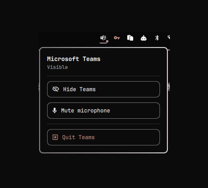

<h1>Teams for the Omarchy bar</h1>

A bar widget that gives the Microsoft Teams **web app** the behaviour the Linux
desktop client never had: a Dock-style icon with an unread badge, hide instead
of quit, microphone control, and automatic do-not-disturb while you are in a
call.

Teams on Linux is a browser tab. This makes it feel like an application.



## What it does

- **Dock-style icon.** Always present. Click to show or focus Teams; click again
  while it is focused to hide it, the way clicking a Dock tile does on macOS.
- **Unread badge.** The count comes from the window title, which Teams keeps
  current (`(3) Chat | … | Microsoft Teams`).
- **Hide instead of quit.** Hiding parks the window on a special workspace, so
  Teams stays signed in, connected and warm. Reopening is instant instead of a
  cold start of the whole web app.
- **Presence dot.** Accent when Teams is running, and while you are in a call it
  turns urgent, grows and pulses. It deliberately does not rely on colour alone:
  plenty of themes resolve `accent` and `urgent` to near-identical hues, and a
  7px dot cannot carry the difference.
- **Microphone toggle.** Middle-click the icon, or use the menu.
- **Automatic do-not-disturb.** Notifications are silenced when a call starts and
  restored when it ends. A do-not-disturb *you* switched on is left alone — the
  widget only undoes what it did itself.
- **A menu**, on right-click, holding show/hide, mute, and quit.

## Install

```bash
omarchy plugin add https://github.com/haripako/plugin-microsoft-teams-omarchy.git --enable
```

The command above works today and needs nothing else. There is also a
[marketplace listing](https://omarchyplugins.com/plugin.html?id=io.github.haripako.teams)
([submission](https://github.com/HANCORE-linux/omarchy-plugin-marketplace/issues/2592)),
which is awaiting maintainer approval — until it is approved that page will say
the plugin was not found.

Then add the widget to your bar, if it did not land there automatically:

```bash
omarchy bar put io.github.haripako.teams --section right
omarchy restart shell
```

You also need Teams itself as a web app. If you do not have one yet:

```bash
omarchy webapp add Teams https://teams.microsoft.com
```

## Settings

Set these on the widget's entry in `~/.config/omarchy/shell.json`, or through
`omarchy bar set io.github.haripako.teams <key> <value>`.

| Key | Default | What it does |
|---|---|---|
| `autoDnd` | `true` | Silence notifications while a call is in progress. |
| `homeWorkspace` | `""` | Workspace to return Teams to when unhiding. Empty follows the active workspace. Set it if a window rule pins Teams somewhere. |
| `url` | `https://teams.microsoft.com` | Opened when Teams is not running. |
| `matchClass` | `chrome-teams` | Substring matched against the window class to find the Teams window. |
| `pollInterval` | `2000` | How often the window state is re-read, in milliseconds. |
| `micApp` | `chromium` | Process a capture stream must belong to before it counts as a call. |
| `notificationsPlugin` | `""` | Empty auto-detects the notification service. Set it only if detection picks the wrong one. |

### About `micApp`

A call is detected by looking for a live microphone capture stream. Filtering by
process matters: without it *any* application touching the microphone — a
recorder, another meeting app, OBS — would read as "Teams is in a call" and
force do-not-disturb on.

Teams runs inside Chromium, and Chromium keeps its audio in a **separate process
from the window**, so the window's PID cannot be used for matching. The process
name is the reliable signal. If you run Teams in something other than Chromium,
set this to that browser's binary name.

### About `notificationsPlugin`

The notification service is found by capability rather than by id, because
`omarchy plugin clone` gives a clone a new id **and disables the original** —
so looking up a fixed `omarchy.notifications` returns nothing on any machine
whose owner has cloned it, and auto-DND would silently do nothing. Leave this
empty unless you have several notification services and detection picks wrong.

## Controls

| Input | Action |
|---|---|
| Left click | Show or focus Teams; hide it if it is already focused |
| Middle click | Toggle the microphone |
| Right click | Open the menu |
| `h` / `m` / `q` in the menu | Hide-show / mute / quit |
| `Esc` in the menu | Close the menu |

Quitting lives inside the menu on purpose. It is the one action that actually
kills the app rather than parking it, and a right-click that closes your chat
client without asking is not something anyone expects.

## IPC

```bash
omarchy-shell teams toggle     # show or hide the window
omarchy-shell teams show
omarchy-shell teams hide
omarchy-shell teams quit       # actually close Teams
omarchy-shell teams menu       # open the widget's menu
omarchy-shell teams refresh    # re-read window state now
```

## Optional: keybindings

`hypr/bindings.snippet.lua` in this repository can be appended to
`~/.config/hypr/bindings.lua`. It adds:

- `SUPER + SHIFT + T` — open or focus Teams
- `SUPER + H` — hide/show toggle
- `SUPER + W` — **hides Teams instead of closing it**, while closing every other
  window normally

The last one goes through `bin/omarchy-teams-close`, which needs to be on your
`PATH` (`install.sh` puts it in `~/.local/bin`). It reads the active window's
class and either hides Teams or closes the window.

Note that it calls `hl.unbind("SUPER + W")` first. Binding the same key twice
does not replace the old binding, it **stacks** — without the unbind, Teams
would be hidden *and* closed.

## Removal

```bash
omarchy plugin remove io.github.haripako.teams
rm -f ~/.local/bin/omarchy-teams-close
omarchy restart shell
```

Then, if you added them by hand:

- delete the appended block from `~/.config/hypr/bindings.lua`, and the one
  from `~/.config/hypr/hyprland.lua` if you used the workspace pinning
- run `hyprctl reload`

Delete the bindings block **before** removing `omarchy-teams-close`, or in the
same pass. That block contains `hl.unbind("SUPER + W")`, so leaving it behind
while deleting the script it points at leaves `SUPER + W` bound to something
that no longer exists — that is, no way to close any window.

If Teams is parked on the hidden workspace when you remove the widget, bring
it back first with `omarchy-shell teams show`, or afterwards with:

```bash
hyprctl dispatch 'hl.dsp.focus({ workspace = "special:teamshidden" })'
```

## Requirements

- Omarchy 4 (the widget uses the Lua `hl.dsp` dispatch API)
- Teams running as a Chromium web app
- PipeWire, for call and microphone detection

## Limitations

- **Teams web cannot share system audio on Linux.** Screen video and microphone
  work; playing a video with sound into a meeting does not. That is Microsoft's
  limitation, not this widget's.
- **Switching chats refetches from the network.** The Teams web client keeps no
  local message store, so returning to a chat you just left reloads its history
  and attachments. No setting here changes that.
- **Presence is derived, not real.** The dot reflects whether a microphone
  stream is live, not your actual Teams status. Reading and setting real
  presence needs Microsoft Graph (`Presence.Read` / `Presence.ReadWrite`), which
  needs an app registration in your tenant — often something only IT can create.
  The widget is structured so a presence service can be added later without
  disturbing anything else.

## License

MIT. See [LICENSE](LICENSE).
